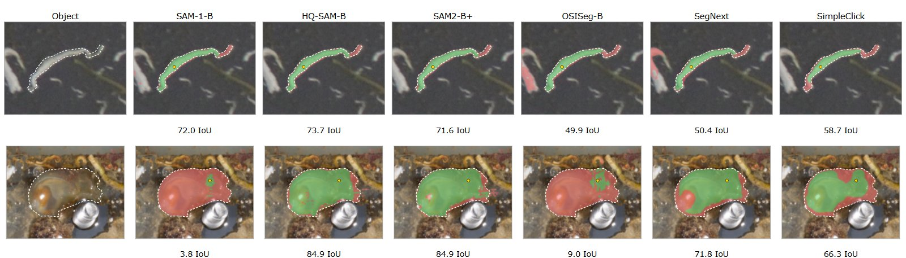
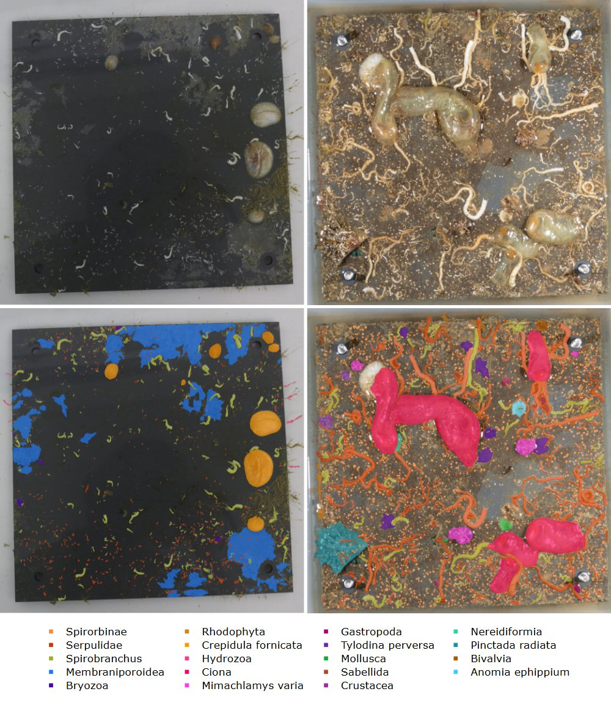

# ARMS Segmentation Benchmark

Code for the master's thesis *Benchmarking Interactive and Automated Segmentation Models on
Autonomous Reef Monitoring Structures Images* (University of Salzburg and University of South
Brittany, 2026).

**Joshua Owen Mangotang**, supervised by Dr. Minh-Tan Pham, Dr. Hoàng-Ân Lê (University of
South Brittany) and Gella Getachew Workineh (University of Salzburg).

<p align="center">
  
  <br><em>Masks from each interactive model after a single click. Green: prediction and annotation agree; red: only one of them.</em>
</p>

## Overview

The benchmark measures how well existing segmentation models can take over the expert
annotation of Autonomous Reef Monitoring Structures (ARMS) plate images, in two settings:

- **Interactive segmentation:** the model segments one organism from simulated clicks or a box.
- **Automatic instance segmentation:** a detector finds, classifies and segments every organism.

Each model is trained on Belgium, Crete, or both sites combined, and tested on both sites using
fixed plate-disjoint splits.

| Setting     | Models                                                                  |
| ----------- | ----------------------------------------------------------------------- |
| Interactive | SAM-1-B, HQ-SAM-B, SAM2-B+, OSISeg-B, SegNext, SimpleClick              |
| Automatic   | Mask R-CNN (R50-FPN), YOLO11s-seg, YOLO26s-seg, at native size and 1024 |

**Data.** ARMSDS (Hadjipieris et al., 2026): 38 plates from Belgium (North Sea) and Crete
(Mediterranean), cut into 832 tiles of 1024 x 1024 with 16,638 annotations. The benchmark uses
the five most frequent classes at each site (eight in total, two shared). A phylum-level label
set (five phyla per site, three shared, seven combined) is used with YOLO11s-seg.

<p align="center">
  
  <br><em>Plates from Belgium (left) and Crete (right) with their annotations. Images: ARMSDS, CC BY 4.0.</em>
</p>

**Metrics.** Macro IoU over ten seeded prompt draws for one-pass prompts; micro IoU, NoC@85 and
NoF@85 for 20-click iterative correction (RITM protocol); matched-mask IoU, mAP and AP50 at a
0.5 confidence threshold for the automatic models.

## Repository Structure

```
arms/           shared library: prompt samplers, datasets, early stopping, taxonomy
assets/         figures used in this README
configs/        OSISeg configuration
env/            conda environment and pip freeze
eval/           evaluation of the interactive models (multieval.py), latency benchmark
experiments/    frozen splits (manifests) used for all results
notebooks/      results.ipynb (tables) and visuals.ipynb (figures)
scripts/        data preparation, job launchers, figure scripts
  slurm/        SLURM training and evaluation jobs
  taskB/        automatic models: data conversion, training, scoring
third_party/    fetches the model repositories at the commits used
train/          training scripts for the interactive models; specialist/ for SegNext and SimpleClick
```

Data, weights and outputs are not included.

## Installation

Tested on Linux with NVIDIA GPUs: Python 3.10, PyTorch 2.1.2 (CUDA 12.1), torchvision 0.16.2,
Ultralytics 8.4.60, detectron2 (commit e0ec4e1). The scripts expect this repository in a folder
named `arms_benchmark` inside a project folder (`BASE` in the scripts).

```bash
mkdir arms && cd arms
git clone https://github.com/joshuaowm/arms-benchmark-thesis.git arms_benchmark
conda env create -f arms_benchmark/env/environment_torch-arms.yml
conda activate torch-arms
bash arms_benchmark/third_party/setup_third_party.sh               # model code into code/
BASE=$PWD bash arms_benchmark/scripts/install_specialist_ft.sh     # SegNext/SimpleClick configs
```

SegNext and SimpleClick use separate environments (`rclicks` with mmcv 2.1.0, `simpleclick` with
mmcv 1.7.2). Place the pretrained weights at these paths in the project folder:

| Model            | Path                                                        |
| ---------------- | ----------------------------------------------------------- |
| SAM ViT-B        | `code/OSISeg/pre_weights/sam_vit_b_01ec64.pth`              |
| HQ-SAM ViT-B     | `code/sam-hq/pretrained_checkpoint/sam_hq_vit_b.pth`        |
| SAM 2.1 Hiera-B+ | `code/sam-hq/sam-hq2/checkpoints/sam2.1_hiera_base_plus.pt` |
| SegNext          | `code/SegNext/weights/vitb_sa2_cocolvis_hq44k_epoch_0.pth`  |
| SimpleClick      | `code/SimpleClick/weights/cocolvis_vit_base.pth`            |
| YOLO             | `yolo11s-seg.pt`, `yolo26s-seg.pt`                          |

Mask R-CNN starts from the detectron2 model zoo.

## Data Preparation

Place ARMSDS under `dataset/deliverable_dataset/<site>/full_plate/` (`annotations.coco.json`
and `train_stitched/`), then build the tiles and COCO files:

```bash
python arms_benchmark/scripts/build_plate_grid.py --site Belgium
python arms_benchmark/scripts/build_plate_grid.py --site Crete
python arms_benchmark/scripts/build_manifests.py
python arms_benchmark/scripts/build_combined_allclass_coco.py
bash arms_benchmark/scripts/taskB/submit_taskB.sh build species
bash arms_benchmark/scripts/taskB/submit_taskB.sh build phylum
```

All jobs read the splits from `experiments/manifests_v11/` (species) and
`experiments/manifests_phylum/` (phylum); rebuilding writes to `<project>/experiments/` and
never overwrites them. Update the `coco` and `images_dir` paths in the manifests to your data.

## Training and Evaluation

`scripts/submit_experiments.sh` submits all experiments to SLURM. Without `--go` it only
prints the job list.

```bash
bash arms_benchmark/scripts/submit_experiments.sh --go                     # all blocks
EXPERIMENTS="E5" bash arms_benchmark/scripts/submit_experiments.sh --go    # one block
```

| Block | Contents                                                                              |
| ----- | ------------------------------------------------------------------------------------- |
| E1234 | SAM-family models and OSISeg per regime, and zero-shot runs of all interactive models |
| E5    | automatic models with species labels; YOLO11s-seg with phylum labels                  |
| E267  | one-pass prompt variants and iterative correction (HQ-SAM-B, SegNext)                 |

Results go to `<project>/outputs/v15/`. Submitted separately:

- **K sweep (Table 4.3):** `eval_cell.sbatch` with `PROMPTS=ksweep ZEROSHOT=0` for HQ-SAM-B.
- **Fine-tuned SegNext and SimpleClick:** `train_specialist.sbatch`, then `eval_specialist.sbatch`.
- **Phylum mAP and AP50 (Table 4.7):** E5 phylum jobs with `VTAG=v16tb`.

## Reproducing the Thesis Results

| Thesis                        | Source                                                         |
| ----------------------------- | -------------------------------------------------------------- |
| Tables 3.1, 3.2               | tile annotations and `experiments/manifests_v11/`              |
| Table 3.3                     | results.ipynb, Methods                                         |
| Tables 4.1, 4.2               | results.ipynb, sections 1, 1b and 2                            |
| Table 4.3                     | results.ipynb, section 3.1b                                    |
| Table 4.4, Figure 4.3         | results.ipynb, sections 3.3 and 3.4; `scripts/export_iter_curves.py` |
| Tables 4.5, 4.6               | results.ipynb, sections 5, 5b and 5.1                          |
| Table 4.7                     | results.ipynb, sections 6, 6b and 6.1                          |
| Figures 3.1 to 3.4, B.1, B.2  | visuals.ipynb; `scripts/make_top10_stacked.py`                 |
| Figures 4.1, 4.2              | `notebooks/regen_qual_figs.py`                                 |

## Notes

- **Paths.** Scripts contain the original cluster paths (`BASE`/`ROOT` set to
  `/share/castor/home/e2406747/axolotl`, plus the `.sbatch` headers and conda paths). Replace
  them with your project folder. The notebooks set `BASE = Path("..")`; point it to the project
  folder.
- **SimpleClick box.** Table 4.1 reports SimpleClick's box results from before a fix to its
  zoom-in crop; this code includes the fix. results.ipynb section 1b compares both.
- **Phylum class ids.** Class ids index the seven combined phyla, so shared phyla keep the same
  id at both sites. The v15 runs numbered each site's phyla separately, so their Table 4.7 IoU
  was re-scored by class name (`REMAP=1`).
- **Randomness.** OSISeg seeds its training prompts with Python's `hash()`, so they only
  repeat with `PYTHONHASHSEED` set. Run-to-run variation is about 0.59 macro IoU for the
  interactive models and 5.78 matched IoU for the automatic models.
- **Naming.** `v11`/`v12` prefixes come from earlier development rounds; all thesis results are
  from the v15 runs.

## Citation

```bibtex
@mastersthesis{mangotang2026arms,
  title  = {Benchmarking Interactive and Automated Segmentation Models on Autonomous Reef
            Monitoring Structures Images},
  author = {Mangotang, Joshua Owen},
  school = {University of Salzburg and University of South Brittany},
  type   = {Master's thesis},
  year   = {2026}
}
```

Please also cite the dataset: Hadjipieris et al., *ARMSDS*, Zenodo, 2026,
[doi:10.5281/zenodo.22042300](https://doi.org/10.5281/zenodo.22042300).

## Acknowledgements

Carried out within the Erasmus Mundus Joint Master "Copernicus Master in Digital Earth",
co-funded by the European Union. Built on
[SAM](https://github.com/facebookresearch/segment-anything),
[HQ-SAM](https://github.com/SysCV/sam-hq),
[SAM 2](https://github.com/facebookresearch/sam2),
[OSISeg](https://github.com/zhilyzhang/OSISeg),
[SegNext](https://github.com/uncbiag/SegNext),
[SimpleClick](https://github.com/uncbiag/SimpleClick),
[detectron2](https://github.com/facebookresearch/detectron2) and
[Ultralytics](https://github.com/ultralytics/ultralytics).

## AI Disclaimer

This repository was developed with the assistance of
[Claude Code](https://claude.com/claude-code) (Anthropic) for writing, debugging and
documenting code. All research decisions and interpretations are the author's own, and all
AI-assisted output was reviewed and verified by the author.

## License

[MIT](LICENSE). The patched SimpleClick file in `third_party/overlay/` stays under SimpleClick's
MIT License; fetched model repositories and dependencies keep their own licenses (Ultralytics
is AGPL-3.0).
